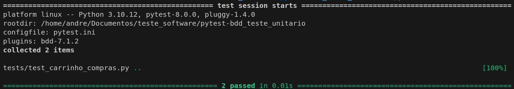
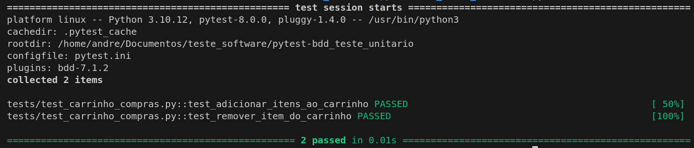

# Carrinho de Compras

Este projeto implementa um simples **Carrinho de Compras**, onde é possível adicionar e remover itens e calcular o valor total dos produtos no carrinho.

## Estrutura do Projeto

O projeto possui as seguintes partes principais:
- `CarrinhoCompras`: Classe responsável por gerenciar os itens no carrinho e suas operações.
- **Testes BDD (Behavior Driven Development)**: Os testes são escritos usando o `pytest-bdd` para definir cenários comportamentais do carrinho de compras.
- **Feature File**: O arquivo `.feature` define os cenários em que os testes são baseados.

## Tecnologias Utilizadas
* Python
* Pytest
* Pytest-BDD

## Pré-requisitos

Certifique-se de ter o Python e o `pip` instalados. Para instalar as dependências necessárias, rode:

```bash
pip install pytest pytest-bdd
```
## Como rodar o projeto
### Execução de Testes
Para rodar os testes de BDD e verificar o comportamento da aplicação:

1 - Navegue até o diretório raiz do projeto.  
2 - Execute o seguinte comando para rodar todos os testes:  
- Modo Padrão  
```
pytest
```
##### resultado
|
- Modo verbose  
```
pytest -v
```
##### resultado
|


## Os seguintes cenários estão cobertos pelos testes:

### Adicionar itens ao carrinho  
Dado que o usuário possui um carrinho de compras com um item, ao adicionar outro item, o total do carrinho é atualizado corretamente.
### Remover item do carrinho  
Dado que o usuário possui um item no carrinho de compras, ao remover este item, o carrinho fica vazio.
